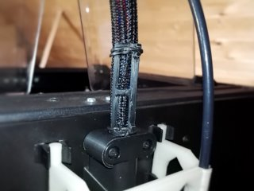
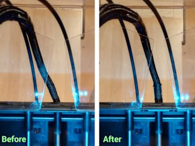
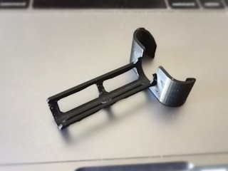

# FlashForge Creator Pro umbilical wire support
*A support to keep the umbilical cord upright on the FlashForge Creator Pro (formerly thing:1703991)*

### License
[Creative Commons - Attribution](https://creativecommons.org/licenses/by/4.0/)

### Gallery

[🔎](images/umbiSupport1.jpg) [🔎](images/umbiSupport2.jpg) [🔎](images/umbiSupport3.jpg)

## Description and Instructions

This is a small upgrade for the 2016 edition of the FlashForge Creator Pro. It is a support that helps to keep the umbilical cord upright. Without this, the cord (which carries the wires going to the extruders and fans) tends to sag to the left on my printer, increasing the risk that it rubs against the transparent cover when it is mounted. This causes noise and puts extra stress on the steppers. With this little support, the cord is better centred.

The only disadvantage is the slightly suggestive shape… but this is no longer visible when installed :)

### Printing

It is advisable to print this in ABS or another plastic that is somewhat flexible, like PETG. PLA is probably too stiff and could break easily.

It is possible to print this thing entirely without supports, if your printer has no problems with bridging. You can enable supports in case the bridging doesn't work out, or to get a nicer looking result (although typically this part will not be very visible…) If you print without supports and you have problems with the small pieces detaching, try adding a brim or perhaps a raft.

The recommended layer height is 0.2 mm. Infill should be irrelevant because this is all outer shell with no large inside volumes.

### Installing

Use two cable ties or zip ties to mount as shown in the photo.

## Updates

### 2016/09/23: v2
I updated the model to v2, it should now be easier to print, be a bit stronger, and easier to attach zip ties or cable ties. It might be possible to print it without supports, if your bridging capabilities are extremely good.

### 2020/08/16: v3
Further tweaked the model to be even stronger and also easier to print.

## Tags
`FFCP`, `FFCPRo`, `support`, `wire`, `wire_guide`
